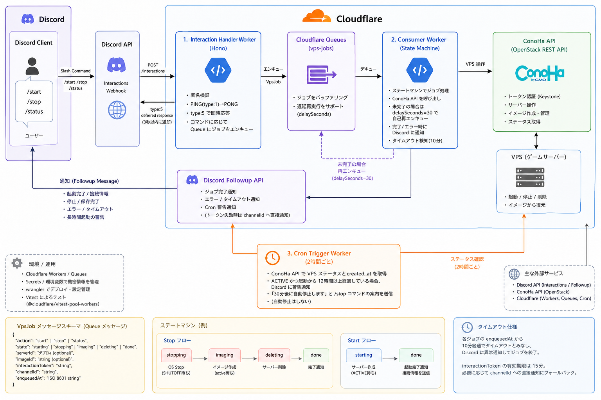

# ginemishi-kun

Discord Slash Command で ConoHa for Games の VPS インスタンスを遠隔操作する Discord Bot。Cloudflare Workers 上で動作し、使用時のみ VPS を起動してコストを最小化する。

## 概要

`/start`・`/stop`・`/status` コマンドで VPS の起動・停止・状態確認ができる。操作は非同期で処理され、完了時に Discord へ通知が届く。

## アーキテクチャ



```
Discord → Cloudflare Workers (Interaction Handler / Hono)
        → Cloudflare Queues (vps-jobs)
        → Cloudflare Workers (Consumer Worker)
        → ConoHa VPS API (OpenStack REST)
```

**3つの Worker エントリーポイント:**

| Worker | ファイル | 役割 |
|--------|----------|------|
| Interaction Handler | `src/index.ts` | Discord Webhook 受信・署名検証・Queue エンキュー |
| Consumer Worker | `src/consumer.ts` | Queue ジョブ処理（ステートマシン） |
| Cron Trigger | `src/cron.ts` | 2時間ごとに長時間起動を監視・通知 |

**Consumer のステートマシン:**
- stop フロー: `stopping` → `imaging` → `deleting` → 完了通知
- start フロー: `starting` → 完了通知（接続情報を Discord に送信）
- タイムアウト: エンキューから10分超過で異常通知して終了

## セットアップ

### 必要なもの

- [Node.js](https://nodejs.org/)
- [Wrangler CLI](https://developers.cloudflare.com/workers/wrangler/)
- Cloudflare アカウント（Workers・Queues 有効）
- ConoHa for Games アカウント
- Discord アプリケーション（Bot トークン・公開鍵）

### Secrets の登録

```bash
wrangler secret put DISCORD_PUBLIC_KEY
wrangler secret put DISCORD_BOT_TOKEN
wrangler secret put CONOHA_USERNAME
wrangler secret put CONOHA_PASSWORD
```

### `wrangler.toml` の設定

`vars` に以下を記載する（機密情報は含めない）:

- `DISCORD_APPLICATION_ID`
- `CONOHA_TENANT_ID`
- 各 API エンドポイント
- `GAME_SERVER_IMAGE_ID`・`GAME_SERVER_FLAVOR_ID`
- `DISCORD_NOTIFY_CHANNEL_ID`

## コマンド

```bash
npm run dev       # ローカル開発サーバー起動 (wrangler dev)
npm test          # テスト実行 (vitest run)
npm run deploy    # Cloudflare Workers へデプロイ (wrangler deploy)
npm run types     # Env 型定義を自動生成 (wrangler types)
```

単一テストファイルの実行:

```bash
npx vitest run test/consumer.test.ts
```

## 設計上の制約

- Interaction Handler は **3秒以内** に Discord へ応答する必要があるため、実処理は Queue に委譲する
- `interactionToken` の有効期限は **15分**。長時間処理では `channelId` への直接 Webhook にフォールバックする
- Queue の `max_retries = 0`。リトライは `delaySeconds=30` の自己再エンキューで管理する
- Cron は **通知のみ**。誤操作防止のため自動停止は行わず、`/stop` コマンドを必須とする
